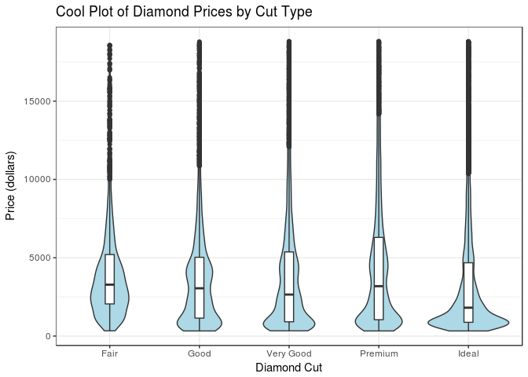
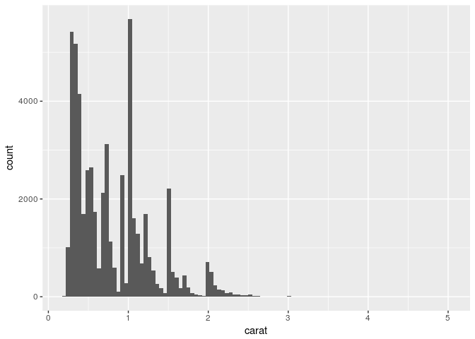
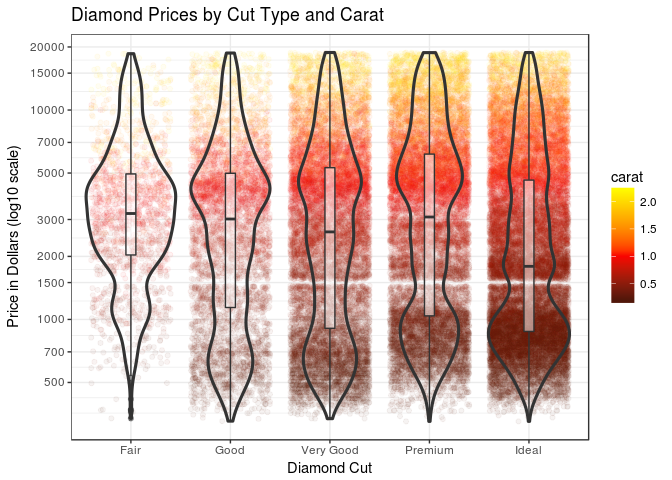
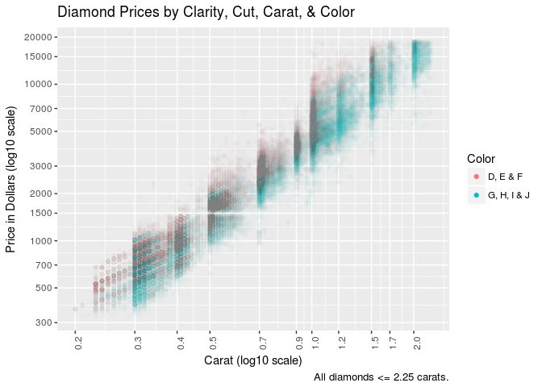
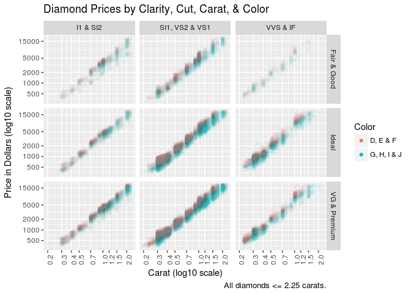
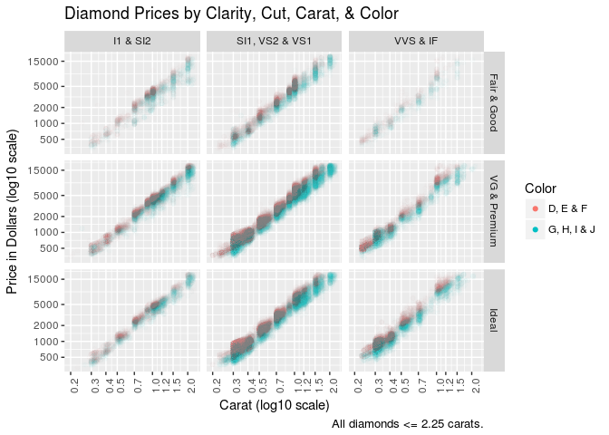
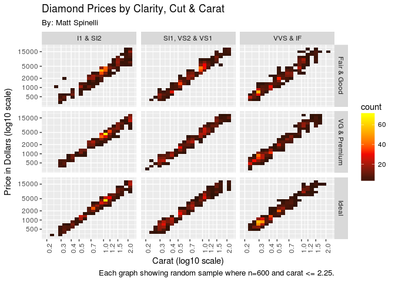

# Playing with ggplot2 on the diamond dataset
Matt Spinelli  
March 1, 2017  


```r
library(ggplot2)
library(dplyr)
library(scales)
```

In the workshop on ggplot2 at Miami University (for preparing for the 2017 ASA DataFest competition), we ended by exploring the diamonds dataset by making the following violin/box plot:


```r
ggplot() + 
  geom_violin(aes(x=cut, y=price), 
              fill='lightblue',
              data=diamonds) +
  geom_boxplot(aes(x=cut, y=price),
               width=.1,
               data=diamonds) +
  theme_bw() +
  labs(x='Diamond Cut', y='Price (dollars)', 
       title='Cool Plot of Diamond Prices by Cut Type')
```

<!-- -->

Let's take this example and see how we can extend it to get more information out of the plot by adding color information and adjusting the y-axis. First let's take a look at the diamond dataset and see what the min/max carat size is:


```r
max_carat = max(diamonds$carat)
max_carat
```

```
## [1] 5.01
```

```r
min_carat = min(diamonds$carat)
min_carat
```

```
## [1] 0.2
```

What does the carat size distribution look like: 


```r
ggplot(diamonds, aes(x=carat)) + geom_histogram(bins=100)
```

<!-- -->

It seems that 2.25 is a decent cutoff to use since this accounts for most of the original dataset but without the few outliers at the top of the range that will add to much empty space to the graphs. Let's see how much of the dataset this retains:


```r
cutoff_carat = 2.25
count(filter(diamonds, carat <= cutoff_carat)) / nrow(diamonds)
```

```
##           n
## 1 0.9932332
```

Great, > 99%, so we don't lose much by doing this. Now we'll want to find the mid-point between the min and cutoff carat size so we can use this with a black-red-yellow color "heat" scale (setting red to the mid-point). We'll use this in a bit. So red will correspond to a carat size of:


```r
scale_midpoint = (cutoff_carat-min_carat) / 2
scale_midpoint
```

```
## [1] 1.025
```

In the violin plot above a lot of the diamonds seemed to bunch up at the bottom of the price scale with some outliers at the top. Let's apply a log transformation to even out the plotting more to get a better view of the data. To add carat size to the graphic we can plot the diamonds in each cut group by using `geom_jitter` with alpha-blending and color set. The jitter will spread out diamonds of the same price horizontally within each group, and the alpha blending will allow us to see where the diamonds group up the most (the color will be stronger).


```r
diamonds %>% filter(carat <= cutoff_carat) %>%
  ggplot(aes(x=cut, y=price, color=carat)) + 
  scale_y_log10(breaks = c(500, 700, 1000, 1500, 2000, 3000, 
                           5000, 7000, 10000, 15000, 20000)) +
  scale_color_gradient2(low = 'black', mid = 'red', high = 'yellow',
                        midpoint = scale_midpoint, 
                        limits=c(min_carat, cutoff_carat)) +
  geom_jitter(alpha=.05) +
  geom_violin(fill=NA, size=1.1) +
  geom_boxplot(width=.10, alpha=.5) +
  theme_bw() +
  labs(x='Diamond Cut', y='Price in Dollars (log10 scale)',
       title='Diamond Prices by Cut Type and Carat')
```

<!-- -->

This is pretty interesting. Also we can see some missing data for pricing around $1500 (unless diamonds never sell a that price which is unlikely). So this plot is helpful. Aside from the missing data, the jitter plot shows the same general distribution of the smoothed violin plots, so it's also a bit redundant. So it would be nice if we could simplify the graph and just have the gradient of carat color to fill the violin plots. Turns out I don't think filling with a gradient is possible, and I would imagine even if it were that we'd need to model each cut grouping by carat and price.

Instead, let's continue exploring some other ways we can look at the data. Can we fit all four Cs into a single plot? We can if we use a facet grid, but it will get really messy since the categorical variables of cut, color, and clarity have quite a few values. So lets see if we can simplify this dataset a bit. It contains colorless diamonds (D, E, and F) as well as near-colorless (G, H, I, J). So it would make sense to group these together in order to engineer a new feature to use. We can also group Fair/Good together as well as Premium/Ideal. We can also do the same with clarity (anything higher than SI1 won't have imperfections visible to the human eye). So I3 and SI2 can be a group. We can reserve VVS and IF to be the top tier and leave SI1 and VS as a middle group.


```r
diamonds2 <- diamonds %>% 
  filter(carat <= 2.25) %>% 
  mutate(color2 = ifelse(color %in% c('D', 'E', 'F'), 
                         'D, E & F', 'G, H, I & J')) %>%
  mutate(cut2 = ifelse(cut %in% c('Ideal'), 
                       'Ideal',
                       ifelse(cut %in% c('Very Good', 'Premium'),
                              'VG & Premium', 'Fair & Good'))) %>%
  mutate(clarity2 = ifelse(clarity %in% c('SI2', 'I1'), 'I1 & SI2', 
                           ifelse(clarity %in% c('SI1', 'VS2', 'VS1'), 
                                  'SI1, VS2 & VS1', 'VVS & IF')))
head(diamonds2)
```

```
## # A tibble: 6 × 13
##   carat       cut color clarity depth table price     x     y     z
##   <dbl>     <ord> <ord>   <ord> <dbl> <dbl> <int> <dbl> <dbl> <dbl>
## 1  0.23     Ideal     E     SI2  61.5    55   326  3.95  3.98  2.43
## 2  0.21   Premium     E     SI1  59.8    61   326  3.89  3.84  2.31
## 3  0.23      Good     E     VS1  56.9    65   327  4.05  4.07  2.31
## 4  0.29   Premium     I     VS2  62.4    58   334  4.20  4.23  2.63
## 5  0.31      Good     J     SI2  63.3    58   335  4.34  4.35  2.75
## 6  0.24 Very Good     J    VVS2  62.8    57   336  3.94  3.96  2.48
## # ... with 3 more variables: color2 <chr>, cut2 <chr>, clarity2 <chr>
```

First let's see if out new groups make sense. Let's see if color has a pattern (note we'll add a log transformation to the y-axis as well which gives the data a linear relationship, and `guides` and `override.aes` is used to keep a solid color in the color key):


```r
ggplot(diamonds2, aes(carat, price)) +
  scale_y_log10(breaks = c(300, 500, 700, 1000, 1500, 2000, 3000, 
                           5000, 7000, 10000, 15000, 20000)) +
  scale_x_log10(breaks = c(.2, .3, .4, .5, .7, .9, 1, 1.20, 1.5, 1.7, 2)) +
  geom_point(alpha=1/100, aes(x=carat, y=price, color=color2)) +
  guides(color = guide_legend(title='Color', override.aes = list(alpha = 1))) +
  theme(axis.text.x = element_text(angle=90)) + #,
  labs(x='Carat (log10 scale)', y='Price in Dollars (log10 scale)',
       title='Diamond Prices by Clarity, Cut, Carat, & Color',
       caption='All diamonds <= 2.25 carats.')
```

<!-- -->

Indeed there appears to be a nice separation of color type and this makes sense as the larger diamonds probably are more likely to have some impurities that will add color. Also notice the x-axis. I've added break points at places that seem to be marketable cut sizes where there are many diamonds at those sizes. Now we can add the other two Cs: clarity and cut using `facet_grid`. We'll back off a bit on the axes labeling breaking to fit the small output size for the graphic.


```r
ggplot(diamonds2, aes(carat, price)) +
  scale_y_log10(breaks = c(500, 1000, 2000, 5000, 15000)) +
  scale_x_log10(breaks = c(.2, .3, .4, .5, .7, 1, 1.20, 1.5, 2)) +
  geom_point(alpha=1/100, aes(x=carat, y=price, color=color2)) +
  guides(color = guide_legend(title='Color', override.aes = list(alpha = 1))) +
  facet_grid(cut2~clarity2) +
  theme(axis.text.x = element_text(angle=90)) + #,
  labs(x='Carat (log10 scale)', y='Price in Dollars (log10 scale)',
       title='Diamond Prices by Clarity, Cut, Carat, & Color',
       caption='All diamonds <= 2.25 carats.')
```

<!-- -->

This is good but can be a bit better, the ordering isn't idea. We'd rather have low quality to high quality (Ideal is misplaced), so to keep the ordering we had when we create these features we need to turn them into factors and run the same plot code again:


```r
diamonds2$cut2 = factor(diamonds2$cut2,
                        levels = c('Fair & Good', 
                                   'VG & Premium', 
                                   'Ideal'))

ggplot(diamonds2, aes(carat, price)) +
  scale_y_log10(breaks = c(500, 1000, 2000, 5000, 15000)) +
  scale_x_log10(breaks = c(.2, .3, .4, .5, .7, 1, 1.20, 1.5, 2)) +
  geom_point(alpha=1/100, aes(x=carat, y=price, color=color2)) +
  guides(color = guide_legend(title='Color', override.aes = list(alpha = 1))) +
  facet_grid(cut2~clarity2) +
  theme(axis.text.x = element_text(angle=90)) + #,
  labs(x='Carat (log10 scale)', y='Price in Dollars (log10 scale)',
       title='Diamond Prices by Clarity, Cut, Carat, & Color',
       caption='All diamonds <= 2.25 carats.')
```

<!-- -->

Instead of using a scatter-plot and if we drop the color data, we can then throw the density of diamonds into nice neat little buckets or bins with `geom_bin` to create a heat map of the density of the diamonds plotted on the graph. Considering that some of the facets above have more diamonds than others, we'll randomly sample 600 diamonds for each group (the smallest group has under 700 diamonds in it). This should keep the comparison somewhat comparable. It turns out when we do this we see some patterns. Low quality clarity seems to focus on cutting diamonds at the marketable 1 carat mark. Ideal cut diamonds with few or no imperfections tend to be small (which makes sense because the larger the diamond the more likely it will have imperfections inside). In the SI1, VS2 & VS1 group, the 1 carat size tends to be more common in the lower quality cuts compared to the ideal.


```r
set.seed(4593)
ggplot(diamonds2 %>% group_by(clarity2, cut2) %>% sample_n(size = 600), 
       aes(carat, price)) +
scale_y_log10(breaks = c(500, 1000, 2000, 5000, 15000)) +
  scale_x_log10(breaks = c(.2, .3, .4, .5, .7, 1, 1.20, 1.5, 2)) +
  geom_bin2d(bins=20) +
  scale_fill_gradient2(low = 'black', mid = 'red', high = 'yellow',
                       midpoint = 32) +
  facet_grid(cut2~clarity2) +
  theme(axis.text.x = element_text(angle=90)) + #,
  labs(x='Carat (log10 scale)', y='Price in Dollars (log10 scale)',
       title='Diamond Prices by Clarity, Cut & Carat',
       subtitle='By: Matt Spinelli',
       caption='Each graph showing random sample where n=600 and carat <= 2.25.')
```

<!-- -->

